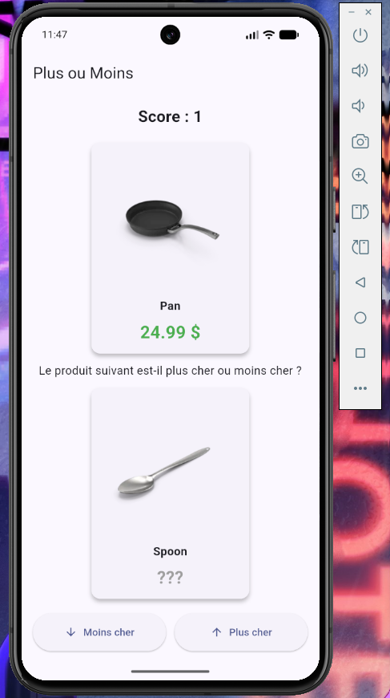
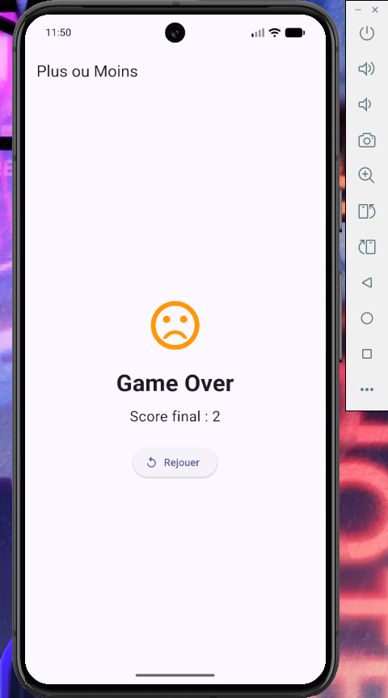
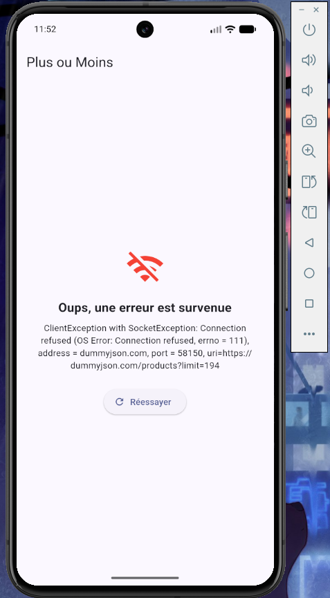

# Plus ou Moins

Mini-jeu mobile du Plus ou Moins développé en Flutter dans le cadre du TP1.

## Le jeu

Le jeu affiche deux produits issus de l'API [dummyjson](https://dummyjson.com/products). Le prix du premier produit est visible, celui du second est caché. Le joueur doit deviner si le second produit est **plus cher** ou **moins cher** que le premier.

- Bonne réponse → +1 point, le second produit devient le premier, et une nouvelle paire est proposée.
- Mauvaise réponse → écran *Game Over* affichant le score final, avec la possibilité de rejouer.

Le critère de comparaison retenu est le **prix**.

## Architecture

Le projet est organisé en couches, chacune avec une responsabilité unique :

```
lib/
├── models/
│   ├── product.dart          # Modèle de données d'un produit (Freezed)
│   └── game_state.dart       # Union d'état du jeu (Freezed)
├── services/
│   └── product_api.dart      # Couche réseau : appel à l'API dummyjson
├── controllers/
│   └── game_controller.dart  # Logique du jeu (Riverpod / Notifier)
└── screens/
    └── game_screen.dart      # Interface utilisateur
```

La séparation est stricte :
- le **service** va chercher les données (et ne connaît rien au jeu) ;
- le **contrôleur** décide de l'état du jeu : comparaison des prix, score, pioche du produit suivant, game over (et ne connaît rien à l'affichage) ;
- l'**UI** lit l'état et envoie des intentions (`guessHigher`, `guessLower`, `playAgain`), sans jamais calculer quoi que ce soit elle-même. Aucune comparaison de prix ne vit dans un widget.

## Packages utilisés

| Package | Rôle |
|---|---|
| `http` | Effectuer l'appel réseau GET vers l'API. |
| `freezed` / `freezed_annotation` | Générer des classes immuables et l'union d'état du jeu. |
| `json_serializable` / `json_annotation` | Générer automatiquement la désérialisation JSON (`fromJson`) du modèle `Product`. |
| `flutter_riverpod` | Gestion d'état réactive (remplace `setState`). |
| `build_runner` | Outil qui lance la génération de code (Freezed, json_serializable). |

## Cadrage de l'API (Partie 1)

Quelques observations sur la réponse de `https://dummyjson.com/products`, qui ont guidé la conception :

- **Structure racine** : la réponse n'est pas une liste de produits directement, mais un **objet** contenant un champ `products` (la liste), accompagné de champs d'information `total`, `skip` et `limit`. Le parsing doit donc lire `json['products']`.
- **Champs réellement utiles** : sur la trentaine de champs renvoyés par produit, seuls **quatre** sont utiles au jeu : `id`, `title`, `price` et `thumbnail` (l'image). Tout le reste (description, stock, reviews, etc.) est ignoré — le modèle est volontairement minimal.
- **Nombre de produits** : l'API renvoie 30 produits par défaut. Le jeu en récupère 100 d'un coup au lancement (`?limit=100`) puis pioche dans cette liste à chaque tour. L'API n'est appelée **qu'une seule fois** par partie.

## Installation et lancement

Ce guide part de zéro : il suppose que tu n'as encore rien installé.

### 1. Installer Flutter

Suis le guide officiel pour ton système : <https://docs.flutter.dev/get-started/install>

Une fois l'installation terminée, vérifie qu'elle est correcte en ouvrant un terminal et en tapant :

```bash
flutter doctor
```

Tu dois voir une liste de coches `[√]`. S'il manque quelque chose (par exemple les licences Android), la commande te l'indique. Pour accepter les licences Android :

```bash
flutter doctor --android-licenses
```

### 2. Récupérer le projet

Clone le dépôt, puis place-toi dans le dossier créé :

```bash
git clone https://github.com/CODEBYGODWIN/plus_ou_moins.git
cd plus_ou_moins
```

### 3. Installer les dépendances

```bash
flutter pub get
```

### 4. Générer le code

Les fichiers `*.freezed.dart` et `*.g.dart` ne sont **pas** inclus dans le dépôt (ils sont régénérés à la demande). Cette étape est donc **obligatoire** après le clone, sinon le projet ne compile pas :

```bash
dart run build_runner build
```

Tu dois voir un message de succès et la création de plusieurs fichiers générés. Si la commande affiche `0 outputs` ou semble bloquée, nettoie puis relance :

```bash
dart run build_runner clean
dart run build_runner build
```

### 5. Préparer un appareil

Il faut un endroit où exécuter l'application. Trois possibilités :

- **Émulateur Android** : ouvre Android Studio → *Device Manager* → crée puis démarre un appareil virtuel. En ligne de commande, tu peux lister tes émulateurs avec `flutter emulators` et en lancer un avec `flutter emulators --launch <id>`.
- **Téléphone Android physique** : active le *mode développeur* et le *débogage USB* sur ton téléphone, puis branche-le en USB.
- **Navigateur web (le plus simple pour tester rapidement)** : aucune configuration, Chrome suffit.

Vérifie que ton appareil est bien détecté :

```bash
flutter devices
```

### 6. Lancer l'application

```bash
flutter run
```

Si plusieurs appareils sont disponibles, Flutter te demande lequel utiliser. Pour cibler directement un appareil précis (par exemple le navigateur) :

```bash
flutter run -d chrome
```

> Astuce : sous VS Code, avec l'extension Flutter installée, tu peux aussi simplement appuyer sur **F5** pour lancer l'application en mode debug.

L'application affiche d'abord un indicateur de chargement, puis le jeu. Amuse-toi bien !

## Captures d'écran

**Jeu en cours :**



**Game Over :**



**État d'erreur réseau :**



## Réflexion

### Pourquoi une union Freezed pour l'état ?

L'état du jeu peut prendre quatre formes mutuellement exclusives : *chargement*, *erreur*, *en cours de partie*, *game over*. Avec une simple classe à plusieurs booléens (`isLoading`, `hasError`, `isGameOver`...), rien n'empêche des combinaisons absurdes : on pourrait se retrouver avec `isLoading == true` **et** `isGameOver == true` en même temps, un état impossible que le code devrait pourtant gérer (ou ignorer, au risque de bugs).

L'union Freezed (`sealed class`) rend ces contradictions **impossibles par construction** : à tout instant, l'état est exactement *une* des quatre variantes, et chaque variante ne transporte que les données qui la concernent (l'état `playing` contient le score et les produits, l'état `error` contient un message, etc.). On ne peut pas accéder au score depuis l'état `loading`, parce qu'il n'y existe tout simplement pas. Le pattern matching force ensuite à traiter chaque cas, ce qui évite d'oublier, par exemple, l'affichage de l'erreur.

### Pourquoi Riverpod plutôt que setState ?

`setState` aurait éparpillé la logique du jeu dans les widgets et mélangé l'état avec l'affichage. En centralisant tout l'état du jeu dans un `Notifier` Riverpod, on obtient une séparation nette : la logique (comparaison des prix, score, pioche) vit dans le contrôleur, et l'UI se contente de lire cet état et de réagir aux changements. Quand l'état change, les widgets qui l'écoutent (`ref.watch`) se reconstruisent automatiquement, sans qu'on ait à déclencher manuellement un rafraîchissement. La règle « aucune règle du jeu dans un widget » devient naturelle à respecter.

### Comment l'absence de réseau est-elle gérée ?

La couche réseau (`product_api.dart`) vérifie le code de statut HTTP et lève une exception explicite en cas d'échec. Cette exception est rattrapée dans le contrôleur (bloc `try/catch`), qui bascule alors l'état du jeu en `GameState.error(message)`. L'interface, en rencontrant cet état, affiche un écran dédié : une icône, un message clair, et un bouton **Réessayer** qui relance le chargement. Il n'y a donc ni écran blanc, ni crash : la coupure réseau (testée en désactivant le wifi) est traitée comme un état normal du jeu parmi les autres. Les cas limites (moins de deux produits reçus, pool de produits épuisé) sont également gérés dans le contrôleur pour éviter tout plantage.